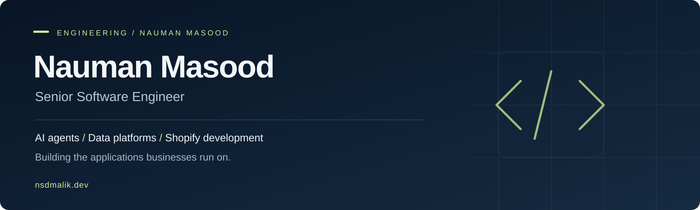

I build **React and TypeScript interfaces, full-stack business applications, and Shopify commerce systems**. My work connects customer-facing experiences with APIs, databases, integrations, and server-side business rules.

I currently work full-time as a **Senior Software Engineer at Framar**. Previously, I worked full-time at **DOONAILS**, leading frontend engineers across storefront architecture, code reviews, delivery planning, and commerce tools.

[Engineering work](https://nsdmalik.dev) · [LinkedIn](https://www.linkedin.com/in/nsdmalik/)

## Selected public engineering

These are independent, runnable implementations with fictional data. They are separate from employer applications and explain their scope and tradeoffs in the documentation.

| Project | What to inspect |
| --- | --- |
| **[Orderdesk](https://github.com/nsdmalik/commerce-orderdesk)** | React, TypeScript, Node.js and PostgreSQL. Regional ordering, session identity, account scope, autosaved drafts, transaction rollback and version conflicts. |
| [Shopify Catalog Readiness](https://github.com/nsdmalik/shopify-catalog-readiness) | Explainable catalog audits, field-level findings, GTIN validation and CI quality gates in JavaScript. |
| [Pipeline Reconciliation Kit](https://github.com/nsdmalik/pipeline-reconciliation-kit) | Transactional ingestion, late data, idempotent retries and confirmed deletion reconciliation. |
| [Design-to-Web Agent Lab](https://github.com/nsdmalik/design-to-web-agent-lab) | A design-to-implementation workflow with planning, validation and bounded repair. |
| [B2B Ordering Portal](https://github.com/nsdmalik/b2b-ordering-portal) | A smaller Python reference for regional prices, case-pack rules and revision-aware preorders. |

## Professional work

- **Commerce interfaces:** subscriptions, upsells, promotional gifts, persistent discounts and checkout handoff.
- **Business applications:** distributor ordering, regional pricing, role-based access, inventory synchronization, invoicing and catalog operations.
- **Frontend leadership:** component architecture, implementation planning, code reviews, performance work and localized storefronts.
- **Data and applied AI:** custom ingestion pipelines, historical reconciliation, conversational analytics, and agents for design and website development workflows.

**Core stack:** React, TypeScript, JavaScript, Node.js, PostgreSQL, SQL, Liquid and Shopify.

**Data and infrastructure:** Python, AWS and Snowflake.

Separately, my independent Shopify consulting spans more than 1,000 stores and over 900 clients, including integrations and migrations to Shopify Plus.

[Explore the broader work →](https://nsdmalik.dev)
